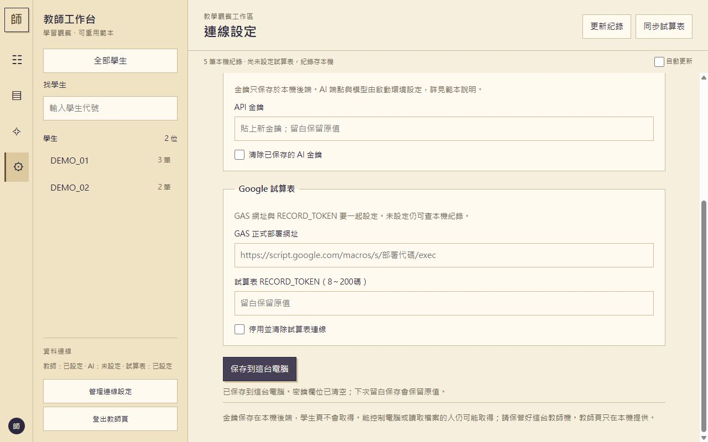
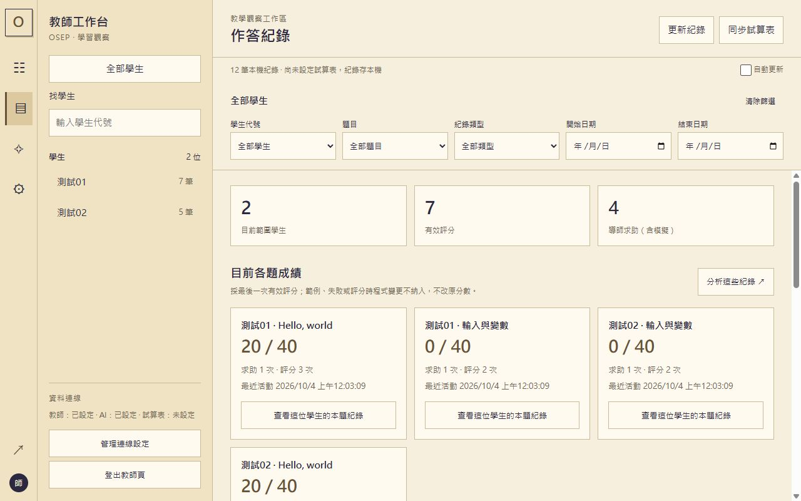
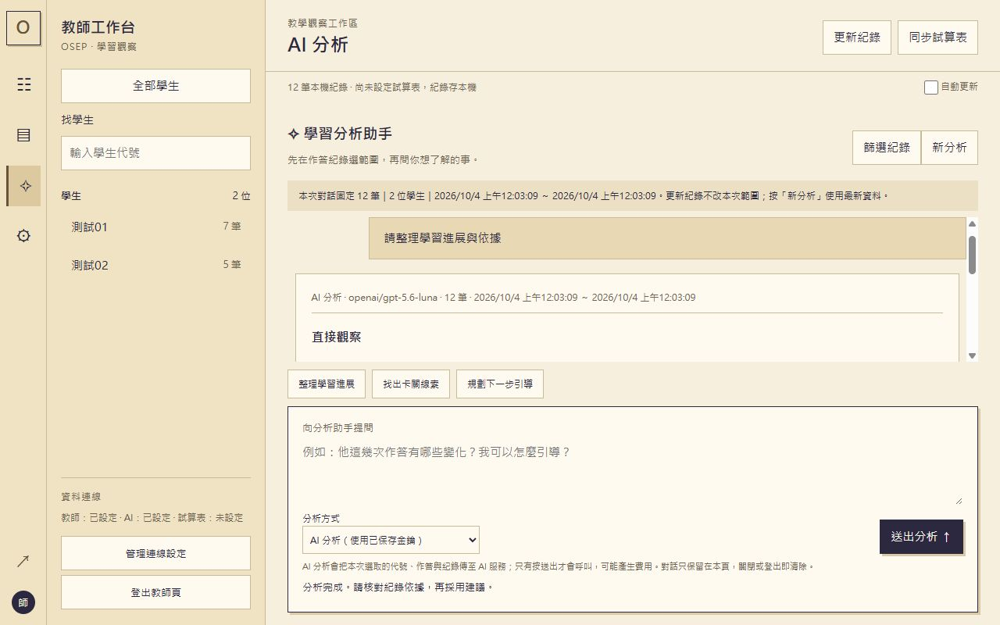
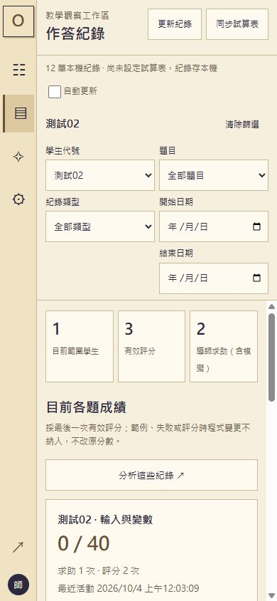

# 教師工作台建立

把「找學生、看作答、整理教學建議」放在同一個工作台的可重用技能與範本。暖米色側欄、清楚的作答時間軸、分析對話，以及集中連線設定，取自 [osep-judge](https://github.com/bai-collab/osep-judge) 的教師介面。

本儲存庫是技能套件，不包含完整Scratch學生編輯器。附帶範本可獨立啟動；套用既有教學程式時，由AI開發助手依技能指引接回原資料和登入。

## 有哪些功能

- 學生代號搜尋、單一學生／全部學生切換、題目／紀錄類型／臺北日期篩選。
- 作答紀錄與最後有效成績；排除範例、失敗與評分期間程式變動，同時間以後保存者優先。
- 展開學生問答與程式結構快照；原分數和滿分保持不變。
- AI分析助手：本機摘要預設不呼叫模型，教師按送出才使用真AI；觀察、推測、建議和限制分開呈現，引用可跳回紀錄。
- 集中設定 **AI API KEY、GAS URL、RECORD_TOKEN**。公開範本token為 **8～200碼**，前端、後端與GAS一致；教師登入密碼仍至少12字。
- 桌面、手機、平板版型；留白保留設定、明確清除、取消不自動重送、登出清空紀錄與對話。

## 範例圖片

公開範本設定頁（密鑰欄位已清空），RECORD_TOKEN為8～200碼：



以下是本次osep-judge教師頁的假資料操作截圖；無真實學生或密鑰。來源專案仍採原32字token規則；此公開範本改為8～200碼。







## 使用技能

將 [skill/teacher-workspace-ui](skill/teacher-workspace-ui/) **整個資料夾**複製到你使用的開發助手技能目錄，例如Codex的 `~/.codex/skills/` 或支援專案技能的 `.agents/skills/`。不要只複製SKILL.md；範本、說明和圖片都是套件的一部分。已有同名技能先比較版本再合併，不直接覆蓋。

開新對話後可這樣要求：

> 使用 $teacher-workspace-ui，為這個教學程式建立教師工作台。沿用學生作答紀錄與教師登入，提供學生搜尋、紀錄查看、AI分析，以及API金鑰、GAS網址、至少8碼的RECORD_TOKEN設定。

入口：[SKILL.md](skill/teacher-workspace-ui/SKILL.md)；中文可見名稱：**教師工作台建立**。穩定識別碼：`teacher-workspace-ui`。其他支援SKILL.md的助手可直接讀入口與其相對連結，實際探索／技能安裝方式依該工具規範。

## 不用AI助手，直接試跑

已存在Node.js 22以上即可，不需要安裝套件。下載本儲存庫後，在儲存庫根目錄執行：

```sh
node skill/teacher-workspace-ui/assets/template/server.mjs --demo
```

開 `http://127.0.0.1:8618/teacher.html`，設定至少12字的教師密碼，其餘先留白。接著搜尋DEMO_01、查看作答、切到分析並選「本機摘要」。假資料模式不會同步到試算表。

正式模式去掉 `--demo`，使用另一份本機資料。AI端點和模型由啟動環境設定，金鑰在教師頁保存。GAS需在自己的試算表部署並設定相同token。完整步驟見 [範本啟動與AI／GAS設定](skill/teacher-workspace-ui/assets/template/README.md)，資料轉接見 [功能與資料契約](skill/teacher-workspace-ui/references/workspace-contract.md)。

## 驗證與使用界線

```sh
node --test skill/teacher-workspace-ui/assets/template/tests/*.test.mjs
```

這套範本使用Node.js內建模組，無第三方執行相依。測試用假學生、假AI及GAS替身；不代表任何真模型的分析準確度，也不代表Google正式部署已成功。AI需支援範本的Responses請求與回覆格式，不相容服務先改轉接。

服務只在教師電腦本機提供。API金鑰與token保存在未提交的local-data，狀態API不讀回；教師密碼雜湊保存，服務密鑰在本機仍是明文。公開發布請保留.gitignore，不提交實際學生紀錄或密鑰。

## 來源與授權

教師模組衍生自 [osep-judge指定版本](https://github.com/bai-collab/osep-judge/tree/56aeace3930dac993dc5515bb63c6380e2bca9bd/scripts/tutor)。公開範本移除學生編輯器依賴與特定服務商接線，新增獨立啟動器、8碼token門檻及可攜技能指引。沿用 [GPL-3.0授權](LICENSE)，保留來源說明。未複製LibreChat程式、商標或使用者參考圖原始資產。

維護來源在本機Harness的 `brain/skills/teacher-workspace-ui/`；本儲存庫的skill目錄是逐檔核對的公開匯出副本，不含Harness設定、私有審查封包或真實local-data。
