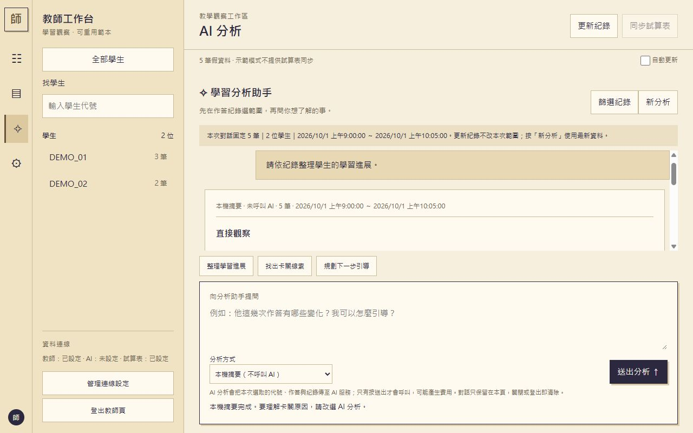

# 範例圖片與來源

公開範本本次實測的8碼設定介面與本機摘要：

下圖使用osep-judge教師工作台與假學生紀錄，不含真實學生、金鑰或token。osep實際介面的token仍為原32字門檻；此公開範本改為8～200碼。兩者是不同設定，原專案沒有被本次變更。

左側找學生，中央可依題目、紀錄類型與日期篩選，查看最後有效成績及歷次作答。

分析分成直接觀察、待確認推測、教學建議與資料限制；引用按鈕能回到原始作答。

窄版保留左側導覽，學生清單由按鈕開關。此圖只展示版型，不代表真AI或GAS部署完成。

来源：[osep-judge教師工作台](https://github.com/bai-collab/osep-judge/tree/56aeace3930dac993dc5515bb63c6380e2bca9bd/scripts/tutor/teacher)。版型參考暖米色側欄與聊天工作區的操作概念，未複製LibreChat程式、商標或附圖原始資產。程式範本沿用osep-judge指定教師模組並移除學生編輯器依賴、服務商專用預設與標頭，新增獨立本機啟動器。
