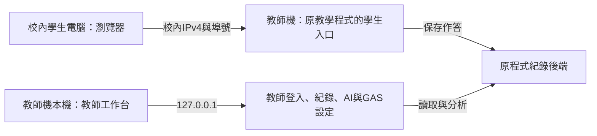

# 校內電腦連線與 Node.js 設定

這套技能沿用「學生端開給教室、教師設定留在教師機」的範圍。區網設定在啟動時選擇，與教師頁的 API 金鑰／GAS 設定分開；沒有把教師設定頁改成遠端管理頁。



## 哪個程式可以開放

| 程式 | 區網能力 | 啟動方式 |
|---|---|---|
| 本技能的獨立教師範本 | 只有教師端，沒有學生編輯器；只在本機8618提供服務 | `node server.mjs --demo` 或 `node server.mjs` |
| 已建置的 osep-judge | 原程式有學生編輯器、紀錄與求助入口；預設8612；教師入口只在本機 | 下方 `start-osep` 轉接器或原 `start-tutor-lan.cmd` |
| 其他 Node.js 教學程式 | 需開發者接上學生入口與權限；設定檔不會自動改造程式 | 使用 `readConfig` 讀設定後整合原啟動器 |

工具只依賴既有 Node.js 22 以上，不安裝套件、不改防火牆、不開放所有網卡，也不替既有專案降低 RECORD_TOKEN 規則。

## 用 osep-judge 當完整例子

1. 教師機準備已建置的 osep-judge 或免建置下載包；要有 `build/editor.html` 與 `scripts/tutor/server.mjs`。學生電腦只需瀏覽器，不需裝 Node.js。請使用自己信任的原程式，轉接器會執行該資料夾的 Node 程式。
2. 先用原專案 `start-tutor.cmd` 啟動，在教師機開 `http://127.0.0.1:8612/teacher.html` 建立教師密碼與 API 金鑰。GAS 是選用；沿用原專案規則，並非公開教師範本的8碼規則。停止原服務視窗再往下做。
3. 在本技能的 `assets/template/` 資料夾開 PowerShell，整段貼上：

```powershell
node --version
node scripts/school-lan.mjs list
$schoolIp = Read-Host '請輸入清單中這台教師機的校內IPv4'
$schoolPort = Read-Host '請輸入埠號，通常是8612'
node scripts/school-lan.mjs configure --ip $schoolIp --port $schoolPort
```

清單顯示「可選」才可用；IP 必須在本機網卡上。私人網段和學校公開網段均可明確選擇；公開格式不等於校外可連或已被防火牆保護，需資訊組核對。排除回送、鏈路本機、多播、保留位址、IPv6、VPN與虛擬網卡；多網卡不自動猜。`configure` 只保存設定，成功後才做下一步。

4. 同一個範本視窗啟動原程式：

```powershell
$osepProject = Read-Host '請輸入已建置osep-judge資料夾的完整路徑'
node scripts/school-lan.mjs start-osep --project $osepProject
```

轉接器把 `TUTOR_LAN=1`、`TUTOR_LAN_IP` 與 `TUTOR_PORT` 傳給原 `scripts/tutor/server.mjs`，不複製原密鑰、不改原始碼。原服務仍會檢查教師設定／AI金鑰、教師與學生路由、求助上限。以原服務「啟動成功」輸出為準；轉接器先印的網址只是準備啟動，若原服務拒絕不能算成功。

5. 服務成功後，將顯示的**學生網址**給校內另一台電腦；教師機自己開顯示的 `127.0.0.1` 教師網址。視窗保持開啟；Ctrl+C停止。更新後端後先關舊服務再啟動；埠已使用代表新服務未啟動，不自動殺掉別的程式。

也可完全不用此工具：在原 osep-judge 的 PowerShell 視窗執行下段（先關閉同埠舊服務）：

```powershell
$env:TUTOR_LAN = '1'
$env:TUTOR_LAN_IP = Read-Host '請輸入教師機的校內IPv4'
$env:TUTOR_PORT = Read-Host '請輸入埠號，通常是8612'
node scripts/tutor/server.mjs
```

詳見 [原專案教師設定說明](https://github.com/bai-collab/osep-judge/blob/56aeace3930dac993dc5515bb63c6380e2bca9bd/TEACHER-SETUP.md)。本工具驗證過設定與轉接行為，尚未在使用者學校另一台電腦確認可連。

## 設定存在哪裡

預設是範本的 `local-data/school-lan.json`，含版本、`access: student-only`、`ip`、`port`、`interfaceName`，沒有 API 金鑰或 token。`.gitignore` 排除整個 local-data；不要提交本機 IP／網卡設定。

已有設定時 `configure` 拒絕覆寫。換學校／換 IP 後，先重新列清單確認，再使用另一份檔名；啟動時指定相同檔案：

```powershell
node scripts/school-lan.mjs list
$schoolIp = Read-Host '請輸入新的校內IPv4'
$schoolPort = Read-Host '請輸入埠號，通常是8612'
node scripts/school-lan.mjs configure --ip $schoolIp --port $schoolPort --config local-data/school-lan-next.json
$osepProject = Read-Host '請輸入已建置osep-judge資料夾的完整路徑'
node scripts/school-lan.mjs start-osep --project $osepProject --config local-data/school-lan-next.json
```

若 school-lan-next.json 也存在，改用新的檔名，不必刪除舊設定。每次啟動都核對網卡名稱及 IP；位址消失或同位址換網卡就拒絕，不改用其他網路。

## 校內連線檢查

依序確認：教師機本機學生頁可開 → 校內第二台電腦可開學生網址 → 校內第二台開同 IP 的教師頁回403 → 假代號評分／求助在教師機出現紀錄 → 如用GAS，直接查看自己的試算表有新列。求助可先用模擬練習；不要為測通訊直接呼叫付費AI。

- 第二台連不上：先檢查服務仍開啟、目前 IP／埠、是否同校網路及無線用戶隔離。Windows 學生機可在PowerShell依序執行 `$teacherIp = Read-Host '請輸入教師機IPv4'`、`$teacherPort = Read-Host '請輸入埠號'`、`Test-NetConnection -ComputerName $teacherIp -Port $teacherPort`，確認TcpTestSucceeded。
- 防火牆：請資訊組只允許必要 TCP 埠及授課電腦／班級網段，依實際網路設定檔設定；不要直接允許所有來源或關閉防火牆。網卡的遮罩不代表授課電腦允許範圍，工具不自行產生防火牆規則。
- 學校採公開 IPv4：用校外連線確認學生網址無法開啟；若校外能連，立即停止服務並請資訊組處理。單一網卡綁定不能阻止被路由到該位址的校外流量。
- 此原程式區網是HTTP，學生作答會經校網傳輸；需限制在校內可信網路。不用路由器轉送埠、不開校外遠端。若要讓其他教師電腦登入工作台，須另行設計HTTPS與教師存取控制；不要把本機教師 `server.listen` 改成 `0.0.0.0`。

## 接入其他 Node.js 專案

複製工具至自己專案後，可從後端匯入 `readConfig(configPath)`：它會檢查設定格式、目前本機網卡、IP和埠號。再由原專案把回傳的 `ip`、`port` 接到**學生專用伺服器**。不會自動掛上教師API、學生資料來源或TLS；不能把含教師路由的既有伺服器直接交給區網。

接線時維持兩個入口：本機教師端綁 `127.0.0.1`；學生端只綁選定 IPv4。學生端採路由白名單，禁止教師頁／教師登入／設定／紀錄讀取與同步；狀態只回必要布林值，不回密鑰或試算表網址。學生API檢查實際Host／Origin、限制請求大小與付費求助，禁止廣域CORS；靜態根目錄只選公開建置檔，不映射local-data。這些需要原專案實作與測試；本設定工具本身不提供路由保護。

技術依據：[Node.js 網卡清單](https://nodejs.org/docs/latest-v22.x/api/os.html#osnetworkinterfaces)、[Node.js 明確監聽位址](https://nodejs.org/docs/latest-v22.x/api/net.html#serverlistenport-host-backlog-callback)。省略host可能綁所有位址，所以接線須明確填入。
